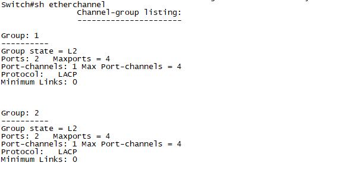
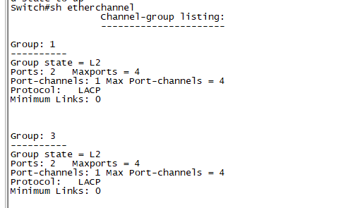
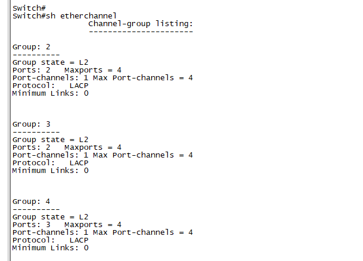
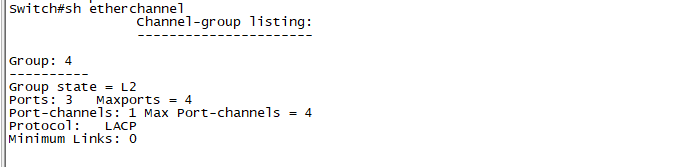
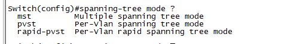
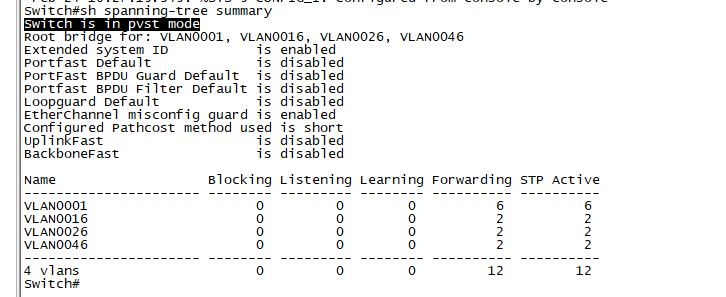

# REDES2_1S2021_P2_GRUPO6

## Topologia Implementada
Para la practica se brindo la red a utilizar 192.168.5X.0/24 pero se pedia modificar los valor X por el numero de grupo por lo tanto al ser el grupo numero 6 se usara X=6 para configurar las direcciones solicitadas.

Se puede observar como quedan las direcciones una vez se ha reemplazado la variable X.

## Configuración de La Topologia
## Tabla de Direcciones de Subred 

|SubRed|VLAN|Direccion de Red|Primera Direccion asignable|Ultima Direccion asignable|Direccion de Broadcast|
|-|-|-|-|-|-|
|**Administracion**|**16**| 192.168.56.0/26 | 192.168.56.1 | 192.168.56.62 | 192.168.56.63
|**Profesores**|**26**| 192.168.56.64/26 | 192.168.56.65 | 192.168.56.126 | 192.168.56.127
|**Clase A**|**36**| 192.168.56.128/26 | 192.168.56.129 | 192.168.56.190 | 192.168.56.191
|**Clase B**|**46**| 192.168.56.192/26 | 192.168.56.193 | 192.168.56.254 | 192.168.56.255

### Hosts

|VLAN|Dispositivo|Direccion Ip|Mascara de Red | Gateway
|-|-|-|-|-|
|**16**|PC-ServidorAdmin|192.168.56.1|255.255.255.192|192.168.56.62
|**26**|PC-ServidorProfesor|192.168.56.65|255.255.255.192|192.168.56.126
|**16**|PC-Administracion1|192.168.56.2|255.255.255.192|192.168.56.62
|**26**|PC-Profesor1|192.168.56.66|255.255.255.192|192.168.56.126
|**16**|PC-Administracion2|192.168.56.3|255.255.255.192|192.168.56.62
|**26**|PC-Profesor2|192.168.56.67|255.255.255.192|192.168.56.126
|**36**|PC-ClaseA1|192.168.56.129|255.255.255.192|192.168.56.190
|**36**|PC-ClaseA2|192.168.56.130|255.255.255.192|192.168.56.190
|**46**|PC-ClaseB1|192.168.56.193|255.255.255.192|192.168.56.254
|**46**|PC-ClaseB2|192.168.56.194|255.255.255.192|192.168.56.254

## Configuracion VTP

### esw1

* conf t
* no ip routing
* fuera del conf t...
* vlan database
* vtp domain grupo6
* vtp password grupo6
* vtp v2-mode
* vtp server

### esw2/esw3/esw4

* conf t
* no ip routing
* fuera del conf t...
* vlan database
* vtp domain grupo6
* vtp password grupo6
* vtp v2-mode
* vtp client

## Configuracion Trunk

### esw1/esw2/esw3/esw4

* int range e x/x - x
* duplex full
* no shu
* switchport trunk encapsulation dot1q
* switchport mode trunk

## Configuracion vlan
- vlan database
- vlan 16 name ADMINISTRACION
- vlan 26 name PROFESORES
- vlan 36 name CLASEA
- vlan 46 name CLASEB
- exit

## Configuracion de intervlan
- configure terminal
- interface vlan 16
- description VLAN ADMINISTRACION
- ip address 192.168.56.62 255.255.255.192
- no shutdown
- exit
- exit

- configure terminal
- interface vlan 26
- description VLAN PROFESORES
- ip address 192.168.56.126 255.255.255.192
- no shutdown
- exit 
- exit

- configure terminal
- interface vlan 36
- description VLAN CLASEA
- ip address 192.168.56.190 255.255.255.192
- no shutdown
- exit 
- exit

- configure terminal
- interface vlan 46
- description VLAN CLASEB
- ip address 192.168.56.254 255.255.255.192
- no shutdown
- exit 
- exit

## Configuracion de Port Channel
Los Port Channel quedaran agrupados de la siguiente forma, para cambiar entre modo LACP solo se cambia el modo como se describe a continuacion

- channel-group # mode active      -----    LACP Port Aggregation Protocol
- channel-group # mode desirable   -----  Pagp Link Aggregation Control Protocol
- Mostrar channel: sh etherchannel

### Configuracion
#### SW1 -LACP
- conf t
- int range e0/0 - 1
- channel-group 1 mode active   

- conf t
- int range e0/2 - 3
- channel-group 2 mode active 

#### SW2 - LACP
- conf t
- int range e0/0 - 1
- channel-group 1 mode active   
- exit
- exit

- conf t
- int range e0/2 - 3
- channel-group 3 mode active 
- exit 
- exit
  

#### SW3 - LACP
- conf t
- int range e0/0 - 1
- channel-group 3 mode active   
- exit
- exit

- conf t
- int range e0/2 - 3
- channel-group 2 mode active 
- exit
- exit
  

- conf t
- int range e1/0 - 2
- channel-group 4 mode active
- exit
- exit

#### SW4 - LACP
- conf t
- int range e1/0 - 2
- channel-group 4 mode active
  

## Protocol Spanning-tree
Su función es la de gestionar la presencia de bucles en topologías de red debido a la existencia de enlaces redundantes 

La imagen utilizada utiliza los siguientes protocolos

para ver el resumen de las configuraciones : sh spanning-tree summary

### Configurando Protocol Spanning-tree
- conf t
- spanning-tree mode <mst | pvst | rapid-pvst>

## Pruebas de Convergencia 
Para realizar las pruebas de convergenia se apagaron el grupo de port channel Po1, y luego de esto se tomo con un temporizador el tiempo que tomo en restablecer la comunicacion entre las diferentes VPC's usando un ping extendido, Los diferentes escenarios con sus respectivos cambios fueron documentados en la siguiente tabla

### Posibles Escenarios
|Escenario|Tipo Port-channel|Protocolo spanning-tree|Tiempo en Seg.
|-|-|-|-|
|**1**|Port Channel LACP |PVST  |44.16 
|**2**|Port Channel LACP |Rapid-pvst  | 
|**3**|Port Channel PAgP |PVST  | 
|**4**|Port Channel PAgP |Rapid-pvst  | 

#
El mejor Escenario segun el estudio realizado es el Escenario # **1** ya que posee el mejor escenario/combinación de protocolo de spanning-tree y tipo de port-channel.